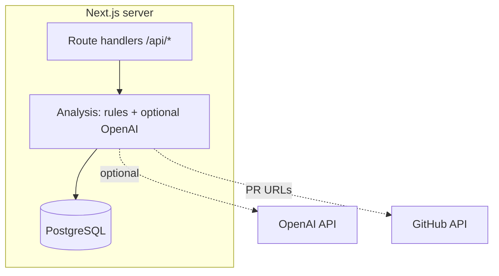
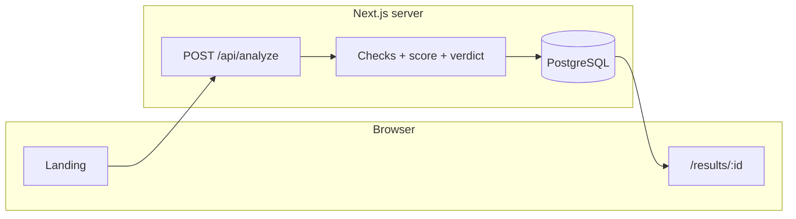
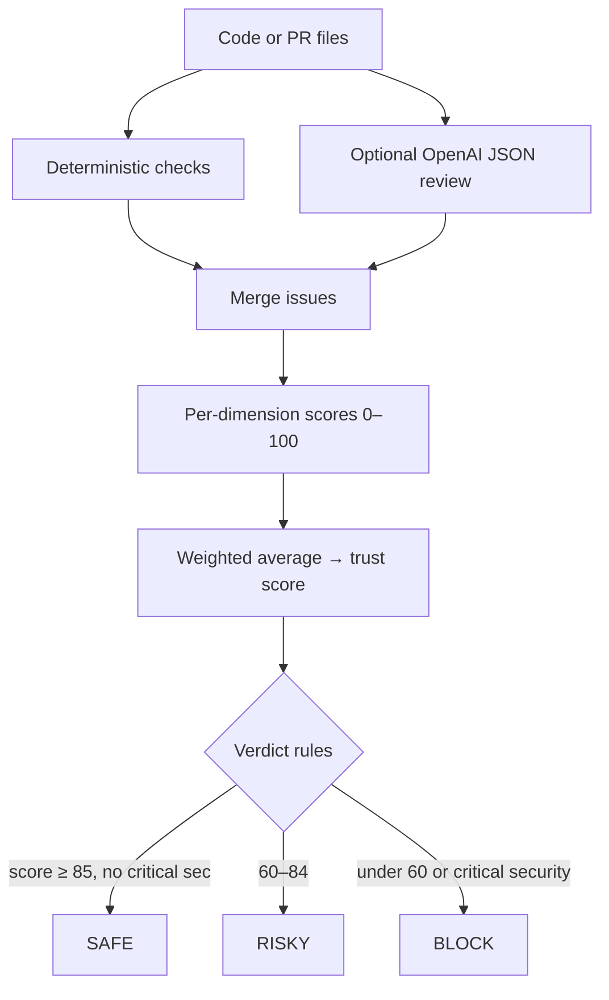

# AI Code Trust

Local web app that runs **deterministic checks** on pasted code or a GitHub PR, optionally adds an **OpenAI JSON review pass** when `OPENAI_API_KEY` is set, then combines everything into a **weighted score** and a **ship verdict** (SAFE / RISKY / BLOCK). Results can be stored in Postgres.

Not implemented yet: background job queues (BullMQ/Redis) and GitHub sign-in. For PR URLs, the app can **post a summary comment** on the pull request when `GITHUB_TOKEN` has permission (disable with `GITHUB_POST_PR_COMMENT=false`).

### Where the backend lives

There is **no separate Fastify service**. The backend is **Next.js on the server**: Route Handlers under `src/app/api/` run on Node, talk to Postgres through Prisma, call GitHub with Octokit, and call OpenAI when configured. One process (`next dev` / `next start`) serves both the UI and the API.



---

## How a request flows



Without `DATABASE_URL`, the same handler still returns a full JSON result on the landing page; nothing is written and there is no saved id to open `/results/:id`.

---

## Pipeline (what the code actually does)



Weights: security 30%, logic 25%, performance 15%, testing 15%, accessibility 10%, maintainability 5%.  
If `OPENAI_API_KEY` is missing or `ENABLE_LLM=false`, the OpenAI step is skipped and only rules run.  
`modelVersion` in responses is `deterministic-v1` or `deterministic+openai-v1`.

---

## Repo layout

| Path | Role |
|------|------|
| `src/lib/analysis/` | Checks, LLM enrich (`llmEnrich.ts`), weights, scoring, decision, summary |
| `src/lib/github/` | Parse PR URL, fetch files, post PR comment |
| `src/lib/db.ts` | Prisma client (Postgres adapter) |
| `src/lib/persistAnalysis.ts` | Save analysis, issues, sources; rerun updates |
| `src/app/api/` | `analyze`, `analysis/[id]`, `analysis/[id]/rerun`, `github/webhook` |
| `src/app/` | UI: landing, `results/[id]` |
| `prisma/schema.prisma` | `Project`, `Analysis`, `Issue`, `Source` |

---

## Requirements

- Node.js 20+ (what Next 16 expects)
- npm
- Postgres reachable from your machine (local Docker is fine)

---

## Setup

**1. Environment**

Copy `.env.example` to `.env` and set at least:

| Variable | Required | Purpose |
|----------|----------|---------|
| `DATABASE_URL` | For persistence | Postgres connection string |
| `GITHUB_TOKEN` | Only for PR URLs | Read repo; also used to post the PR comment |
| `GITHUB_POST_PR_COMMENT` | No | Default on; set `false` to skip posting a comment |
| `OPENAI_API_KEY` | No | Second-pass review; omit for rules-only |
| `OPENAI_MODEL` | No | Defaults to `gpt-4o-mini` |
| `ENABLE_LLM` | No | Set to `false` to force rules-only even with a key |

**2. Database**

```bash
# optional: start local Postgres
docker compose up -d

# apply schema
npm run db:push
```

**3. Install and run**

```bash
npm install
npm run dev
```

Open [http://localhost:3000](http://localhost:3000).

---

## Scripts

| Command | What it runs |
|---------|----------------|
| `npm run dev` | Next.js dev server |
| `npm run build` | Production build |
| `npm run start` | Production server (after build) |
| `npm run lint` | ESLint |
| `npm run db:push` | Push `prisma/schema.prisma` to the DB |

`postinstall` runs `prisma generate` so the client exists after `npm install`.

---

## API (short)

| Method | Path | Notes |
|--------|------|--------|
| `POST` | `/api/analyze` | Body: `{ "code" }` and/or `{ "prUrl" }` and/or `{ "files": [...] }`. Response may include `prCommentUrl` for PR runs. |
| `GET` | `/api/analysis/:id` | Stored row; includes `prCommentUrl` when a comment was posted; needs DB |
| `POST` | `/api/analysis/:id/rerun` | Re-runs from stored input; needs DB |
| `POST` | `/api/github/webhook` | Stub; returns 200 |
