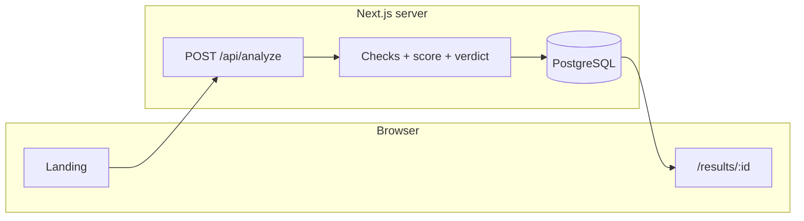
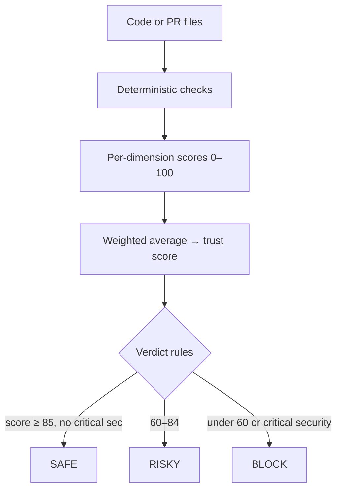

# AI Code Trust

Local web app that runs **static checks** on pasted code or a GitHub PR, combines them into a **weighted score**, and returns a **ship verdict** (SAFE / RISKY / BLOCK). Results can be stored in Postgres.

The product PDFs in this repo describe the fuller vision (LLM layer, queues, GitHub OAuth, PR comments). This codebase implements the **core pipeline + API + UI**; it does **not** yet include async workers, LLM reasoning, or posting comments back to GitHub.

---

## How a request flows



Without `DATABASE_URL`, the same handler still returns a full JSON result on the landing page; nothing is written and there is no saved id to open `/results/:id`.

---

## Pipeline (what the code actually does)



Weights: security 30%, logic 25%, performance 15%, testing 15%, accessibility 10%, maintainability 5%.

---

## Repo layout

| Path | Role |
|------|------|
| `src/lib/analysis/` | Checks, weights, scoring, decision, summary |
| `src/lib/github/` | Parse PR URL, fetch files via Octokit |
| `src/lib/db.ts` | Prisma client (Postgres adapter) |
| `src/lib/persistAnalysis.ts` | Save analysis, issues, sources; rerun updates |
| `src/app/api/` | `analyze`, `analysis/[id]`, `analysis/[id]/rerun`, `github/webhook` |
| `src/app/` | UI: landing, `results/[id]` |
| `prisma/schema.prisma` | `Project`, `Analysis`, `Issue`, `Source` |

---

## Requirements

- Node.js 20+ (what Next 16 expects)
- npm
- Postgres reachable from your machine (local Docker is fine)

---

## Setup

**1. Environment**

Copy `.env.example` to `.env` and set at least:

| Variable | Required | Purpose |
|----------|----------|---------|
| `DATABASE_URL` | For persistence | Postgres connection string |
| `GITHUB_TOKEN` | Only for PR URLs | Read repo contents at the PR head |

**2. Database**

```bash
# optional: start local Postgres
docker compose up -d

# apply schema
npm run db:push
```

**3. Install and run**

```bash
npm install
npm run dev
```

Open [http://localhost:3000](http://localhost:3000).

---

## Scripts

| Command | What it runs |
|---------|----------------|
| `npm run dev` | Next.js dev server |
| `npm run build` | Production build |
| `npm run start` | Production server (after build) |
| `npm run lint` | ESLint |
| `npm run db:push` | Push `prisma/schema.prisma` to the DB |

`postinstall` runs `prisma generate` so the client exists after `npm install`.

---

## API (short)

| Method | Path | Notes |
|--------|------|--------|
| `POST` | `/api/analyze` | Body: `{ "code" }` and/or `{ "prUrl" }` and/or `{ "files": [...] }` |
| `GET` | `/api/analysis/:id` | Stored row; needs DB |
| `POST` | `/api/analysis/:id/rerun` | Re-runs from stored input; needs DB |
| `POST` | `/api/github/webhook` | Stub; returns 200 |

---

## Spec PDFs

- `AI_Code_Trust_Elite_Version.pdf` — product and architecture narrative  
- `AI_Code_Trust_Implementation_Blueprint.pdf` — API sketch and build order  

Use those when extending the app (LLM pass, BullMQ, GitHub App, etc.).
